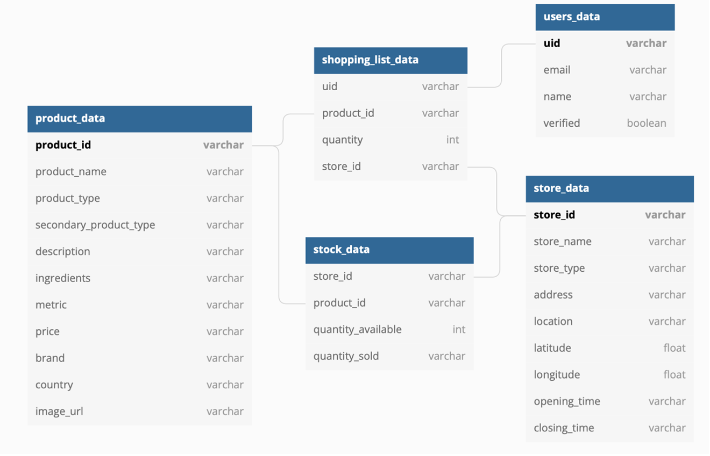

# 50.001 - Groceriio

An Android application aimed at providing stock data to users and allowing users to create self-pick up orders at the supermarket nearest to their location.

## Database Structure

## Functions

### Login & Register (P0)

Email Verification is implemented to make sure each email can only be registered once. 
User have to confirm their email before they can access to our application's functions.

### Map Function (P0)

Google Cloud Platform is utilised to retrieve user's location and compare it with
multiple store locations to identify the closest location from the user.

We also allow user to manually key in their desired location so that they could
help check stock availability for others such as their parents or friends.

Comparator is used to sort the list of Location object in order of nearest to furthest.

### Search Function & View Product Stock (P1)

Upon logging into Grocerrio, user can select a category they are interested in and search for the
item they would like to purchase/check.

## Shopping List (P1)

Add cart button (In ProductPageActivity) to add 1 of the selected products to their shopping list.
Increase or decrease the amount of products by tapping '-' or '+' in ShoppingListActivity.

### Order Function (P1)

This function allow users to place their order to the nearest store from their location.
After placing the order, they should proceed to collect their products from the store.

### Adapters 

There are 3 activities in our application that uses Recycler View.
They are the MainActivity (CategoryAdapter), ProductListActivity (ProductAdapter) and ShoppingListActivity (ShoppingListItemAdapter).

Button clicks are unique to each recycler view in ShoppingListActivity so that the amount of products changes as well as the calculated Total Price.

